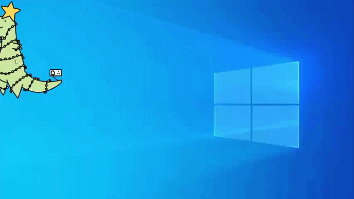

# new-year-tree
Christmas tree on the desktop. 

[Ссылка на статью habr] (https://habr.com/ru/post/597913/) 



## Установка и запуск
Клонировать репозиторий и перейти в него в командной строке:
```
git clone https://github.com/tochilkinva/new-year-tree.git
```
```
cd new-year-tree
```
Cоздать и активировать виртуальное окружение:
```
python3 -m venv venv
```
```
. env/Scripts/activate
```
Обновить PIP и установить зависимости из файла requirements.txt:
```
python3 -m pip install --upgrade pip
```
```
pip install -r requirements.txt
```
Запустить run.py

## Управление
- Левый клик мыши - перемещение картинки
- Правый клик мыши - закрытие программы
- Колесико вверх или вниз - следующая картинка
